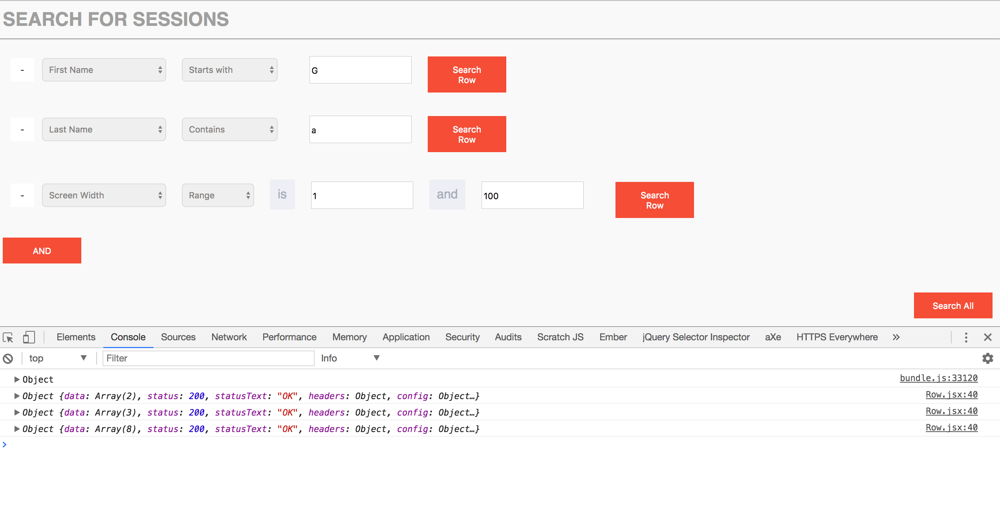

**Quick Search**

Quick Search is an app that filters through a database in response to user queries. The user can search the following fields:

* user email
* screen width
* screen height
* number of visits
* first name
* last name
* page response time (ms)
* domain
* page Path

Some of the filters that the user can impose on the query include:

* Starts with
* Contains
* Does not contain
* Is less than
* And more...

To use the app, simply press the "And" button to add one or more queries. You can then activate the queries using either the "Search Row" button (queries only that row) or the "Search All" button (queries all rows).

The data displays in the browser's console, so in order to see the output, you need to open the browser's dev tools (control-option-i or command-option-i in most browsers). From there, go to Console or the equivalent to view the output.

Finally, you can remove any given row by clicking the "-" button adjacent to that row.

Setup:

* Clone down this repo
* `npm install`
* Create a Postgres database called "quickstart" and be sure your Postgres server is running.
* `knex migrate:latest`
* `knex seed:run`
* `npm start`
* `npm run dev`
* Navigate to http://localhost:3000/ in your browser.

Testing:

* This application was manually testing using a variety of conditions. There are presently no automated tests.

Useful sources:

[Knex.js docs](http://knexjs.org/#Builder-where)

[psql docs on pattern matching](https://www.postgresql.org/docs/9.5/static/functions-matching.html)

[JS Bin on calling child methods from parent React component](https://jsbin.com/wahuzo/edit?html,js,console,output)
(Note: some of my code is adapted from this JS Fiddle; see notes in JS files)

[Adam Horton and Ryan Vice, Mastering React (book)](https://books.google.com/books?id=47FKDAAAQBAJ&pg=PA217&lpg=PA217&dq=react+interpolate+this.refs&source=bl&ots=ttrhDeQbf_&sig=KgBFxjaxnjktW_4-5gqslXb69yU&hl=en&sa=X&ved=0ahUKEwiS96vdzt7SAhWDrJQKHTMiCvwQ6AEIQTAG#v=onepage&q=react%20interpolate%20this.refs&f=false)
